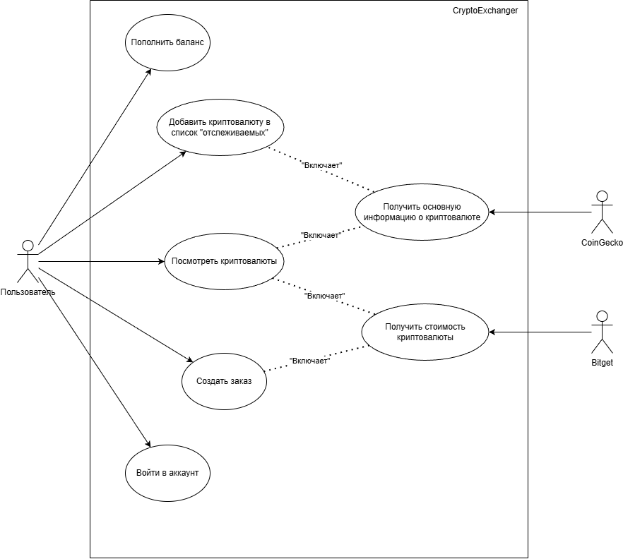
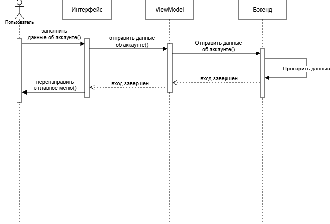
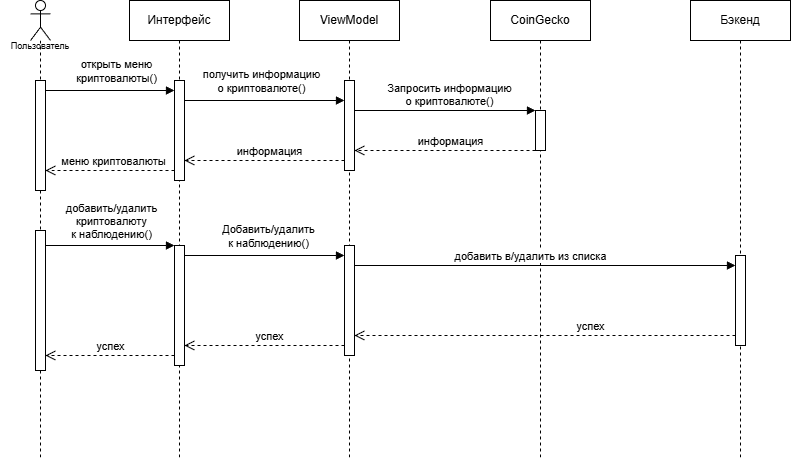
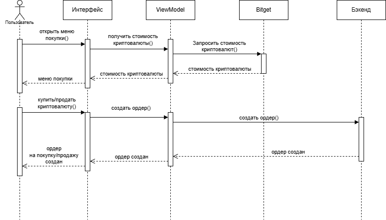

# Файлы
- [Видео работы приложения](docs/media/app-demo.mp4)
- [Презентация](docs/media/presentation.pptx)

# Task1

Мобильное Android-приложение на Kotlin для просмотра крипторынка, работы с watchlist и базового трейдинга. Данные о монетах и рынке берутся из CoinGecko и Bitget.

## Основные возможности
- Авторизация (локальный токен в памяти).
- Главный экран с watchlist и быстрыми переходами к покупке/продаже.
- Список монет и рыночная информация.
- Экран трейда с графиком, выбором пары и операциями Buy/Sell.
- Портфель с распределением активов (pie chart) и переходом к трейду.
- Профиль и выход из аккаунта.

## Технологии
- Kotlin, Android SDK (minSdk 24, targetSdk 36).
- Jetpack Compose, Material 3, Navigation Compose.
- MVVM (ViewModel + Compose state).
- Koin для DI.
- Retrofit + Kotlinx Serialization.
- Coroutines/Flow.
- Coil для загрузки изображений.
- Vico для графиков.

## Архитектура и структура
- `app/src/main/java/ru/vsu/task1/app` — приложение и DI-модули.
- `app/src/main/java/ru/vsu/task1/data` — модели, репозитории, сервисы API, use cases.
- `app/src/main/java/ru/vsu/task1/ui` — экраны, компоненты, навигация и тема.

## Источники данных
- CoinGecko API: список монет и рыночные данные.
- Bitget API: тикеры и свечи для графиков.

## Сборка и запуск
1) Откройте проект в Android Studio и выполните Sync Gradle.
2) Запустите приложение на эмуляторе или устройстве.

CLI (Windows):
```bash
.\gradlew assembleDebug
```

## Конфигурация
- API ключ CoinGecko хранится в `app/src/main/java/ru/vsu/task1/Constant.kt`.

## Диаграммы
<br>
_Рисунок 1 — Use case диаграмма приложения._

<br>
_Рисунок 2 — Диаграмма последовательности: вход._

<br>
_Рисунок 3 — Диаграмма последовательности: добавление/удаление в watchlist._

<br>
_Рисунок 4 — Диаграмма последовательности: покупка валюты._

<br>
_Рисунок 5 — Диаграмма последовательности: список криптовалют._

<br>
_Рисунок 6 — Диаграмма последовательности: баланс._

